# DIGITURNO – Documentación del Frontend

## 1. Información General

**Nombre del proyecto:** DIGITURNO  
**Módulo:** Frontend  
**Tipo:** Aplicación Web  
**Framework:** React 18  
**Lenguaje:** TypeScript  
**Estado:** En desarrollo  

El frontend de DIGITURNO es la interfaz gráfica del sistema de turnos digitales. Permite a los usuarios interactuar con el sistema y a los administradores gestionar turnos, servicios y estadísticas.

---

## 2. Objetivo del Frontend

- Proporcionar una interfaz moderna y responsiva
- Consumir la API REST del backend
- Visualizar turnos y servicios
- Facilitar la gestión del sistema de turnos

---

## 3. Tecnologías Utilizadas

| Tecnología | Descripción |
|---------|------------|
| React 18 | Biblioteca para interfaces |
| TypeScript | Tipado estático |
| React Router DOM | Navegación |
| Axios | Consumo de API |
| CSS3 | Estilos y diseño |
| Node.js | Entorno de ejecución |
| npm | Gestor de paquetes |

---

## 4. Estructura del Proyecto

digiturno-frontend/
│── public/
│   ├── images/
│   ├── sounds/
│   ├── videos/
│   ├── index.html
│   └── manifest.json
│
│── src/
│   ├── components/
│   │   ├── Navbar.tsx
│   │   └── Navbar.css
│   │
│   ├── pages/
│   │   ├── Home.tsx
│   │   └── Home.css
│   │
│   ├── services/
│   │   └── api.ts
│   │
│   ├── types/
│   │   └── index.ts
│   │
│   ├── App.tsx
│   ├── App.css
│   └── index.tsx
│
│── .env
│── package.json
│── package-lock.json
│── tsconfig.json
│── Dockerfile
│── nginx.conf
│── README.md

---

## 5. Instalación del Frontend

Esta sección describe el proceso para desplegar el frontend en un entorno local de desarrollo.

### Requisitos previos
- Node.js 16 o superior
- npm 8 o superior
- Git instalado

### 5.1 Obtención del código fuente
El código fuente del frontend se obtiene desde el repositorio oficial del proyecto:

git clone https://github.com/sloremart/DIGITURNOFRONTED.git

# evidencia:
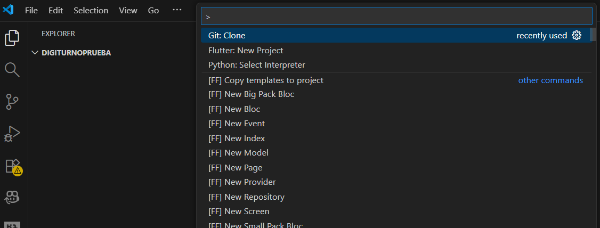

### 5.2 Instalación de dependencias

Ejecutar:
npm install ---> Archivo node_modules creado

# evidencia:
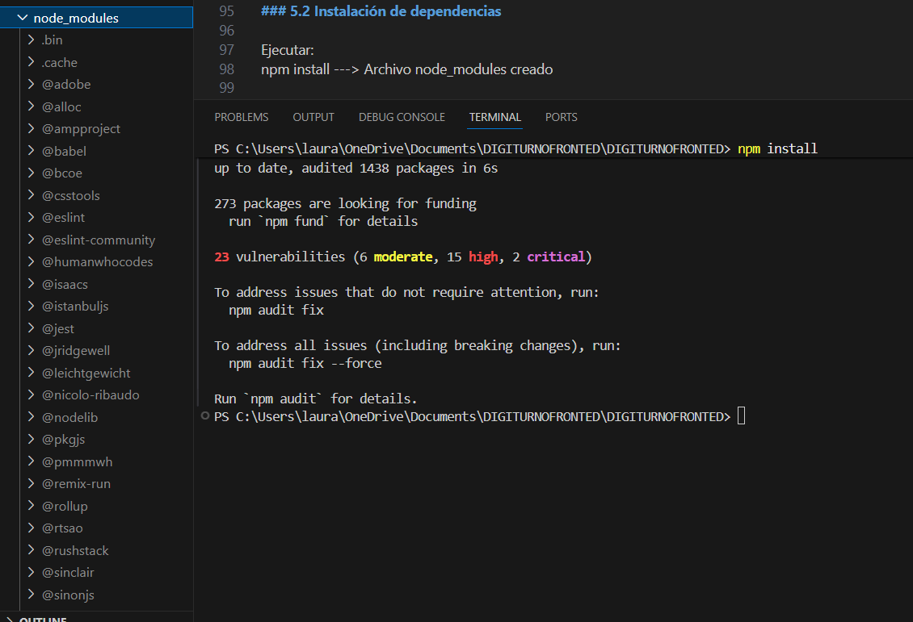

### 6. Configuración de variables de entorno

Esta configuración permite que el sistema funcione en entorno local sin necesidad de variables adicionales.
La URL del backend se encuentra configurada directamente dentro del código fuente del frontend, apuntando por defecto a:
http://localhost:8000

# evidencia:
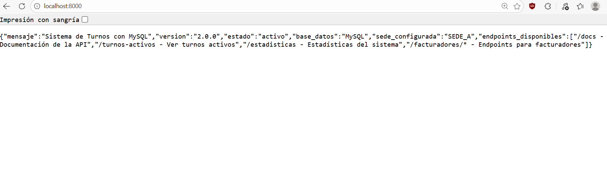

### 7. Ejecución del Proyecto

Para correr el proyecto ejecutar el comando 
npm start

La aplicación se ejecuta en: http://localhost:3000

# evidencia:
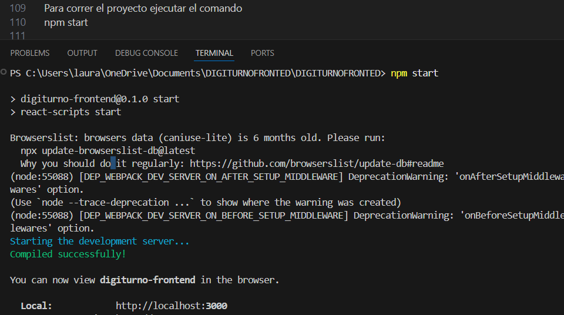
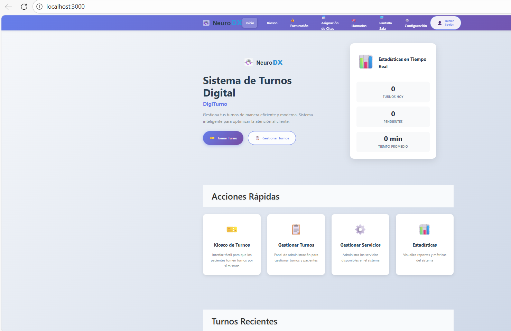

## 8. Comunicación con el Backend

El frontend se comunica con el backend mediante Axios.

| Método | Endpoint      | Descripción      |
| ------ | ------------- | ---------------- |
| GET    | /turnos       | Obtener turnos   |
| POST   | /turnos       | Crear turno      |
| PUT    | /turnos/{id}  | Actualizar turno |
| GET    | /servicios    | Listar servicios |
| GET    | /estadisticas | Ver estadísticas |

# evidencia:
Archivo api.ts
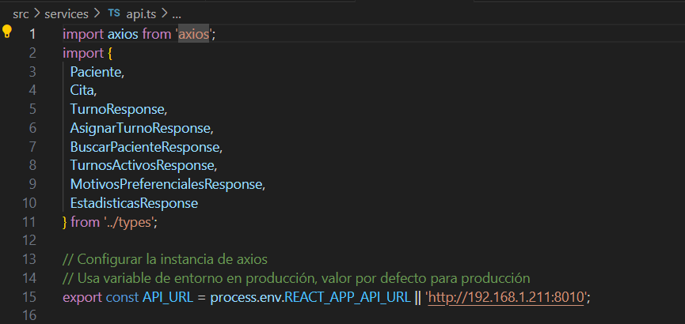
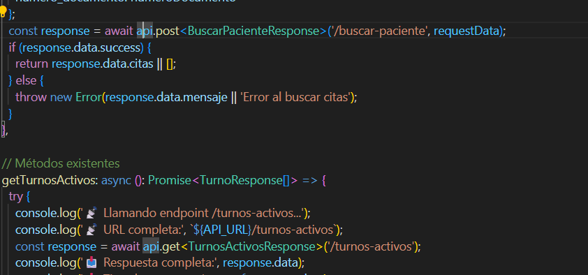

# 9. Tipos de Datos (TypeScript)

El proyecto contiene datos de tipo TypeScript entre estos en el archivo types/index.ts

Archivo types/index.ts
# evidencia:
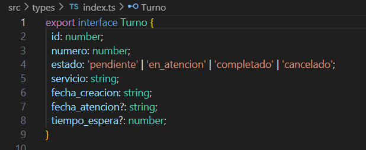

## 10. Diseño y Experiencia de Usuario

Características:

Diseño responsive
Gradientes modernos
Animaciones suaves
Cards con hover
Navegación clara

# evidencia:
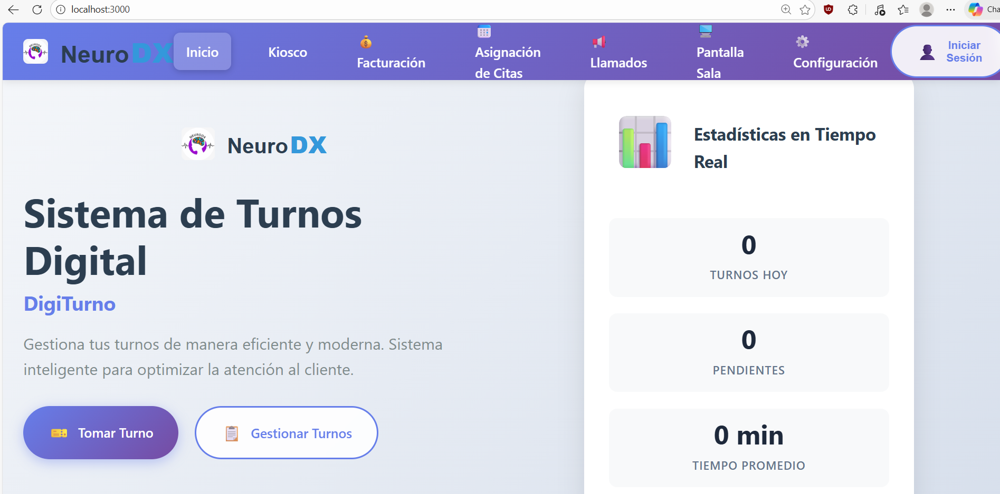

## 11. Scripts Disponibles

| Comando       | Función                |
| ------------- | ---------------------- |
| npm start     | Modo desarrollo        |
| npm run build | Producción             |
| npm test      | Pruebas                |
| npm run eject | Configuración avanzada |

## 12. Contenedorización (Docker)

El frontend incluye Dockerfile y nginx.conf para despliegue.

# evidencia: 

Archivo Dockerfile
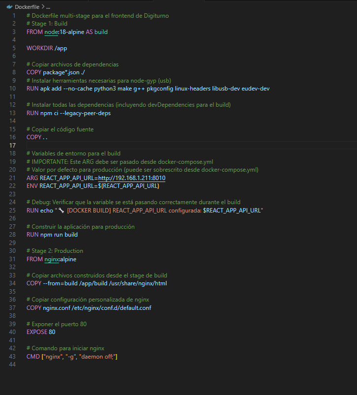

Archivo nginx.conf
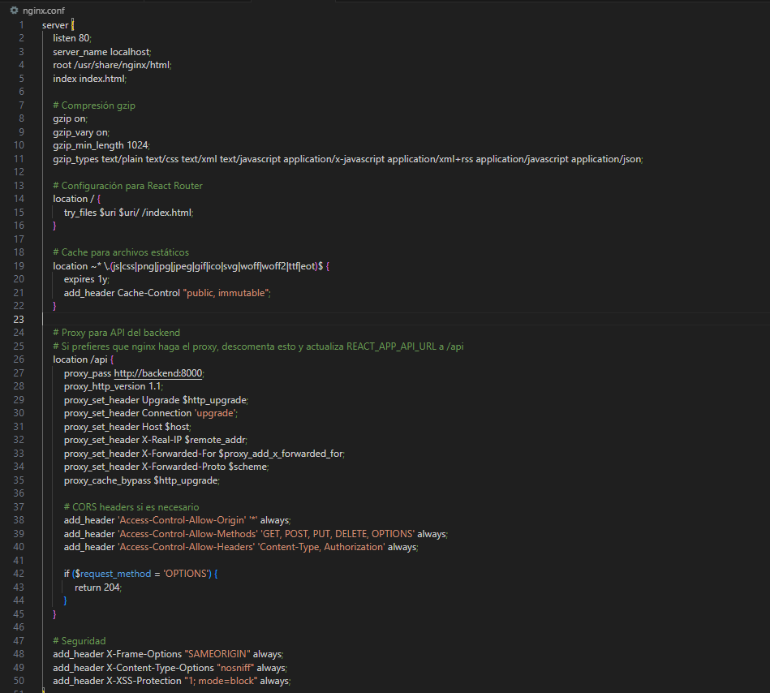

## 13. Estado del Proyecto

Backend: Funcional

Frontend: Funcional

Integración API: Configurada

Documentación: Completa

14. Conclusión

El frontend de DIGITURNO proporciona una interfaz moderna, escalable y preparada para integrarse con servicios backend, cumpliendo buenas prácticas de desarrollo web.

15. Autor

Nombre: sloremart
Proyecto: DIGITURNO
Rol: Desarrollo Frontend